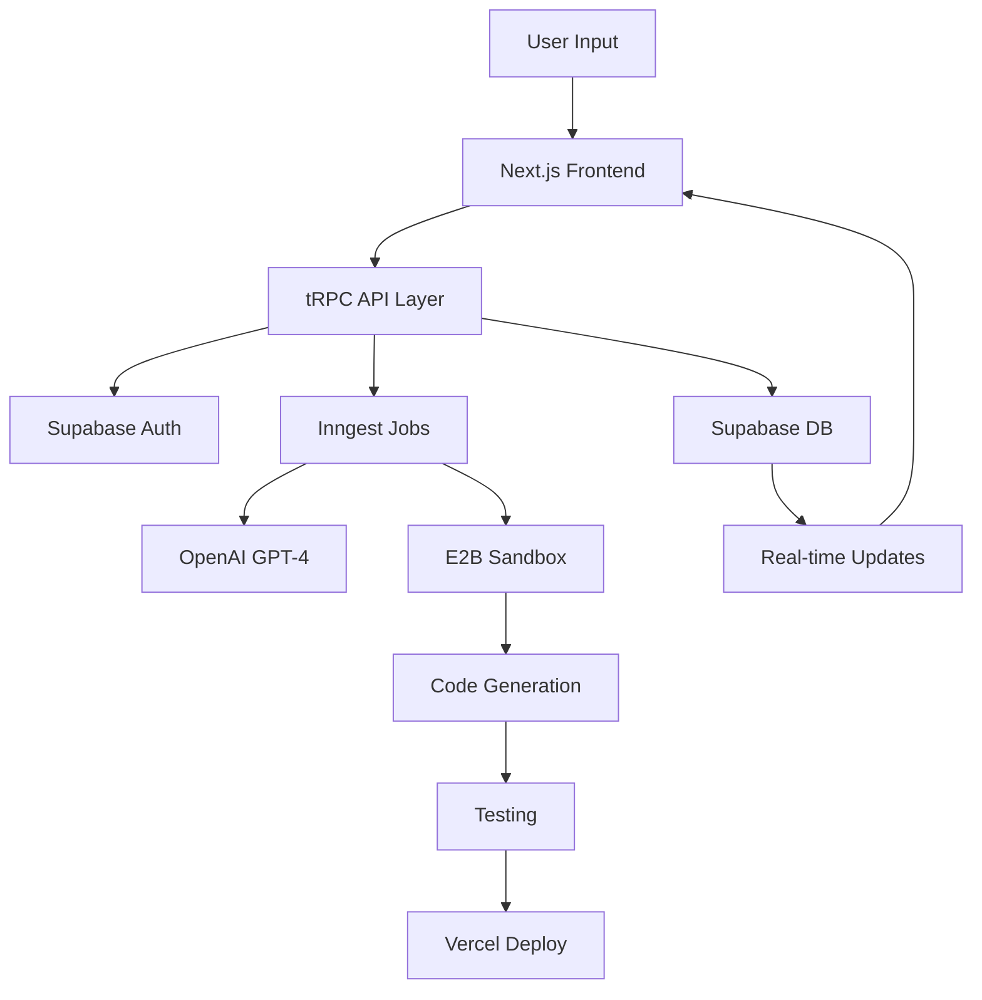
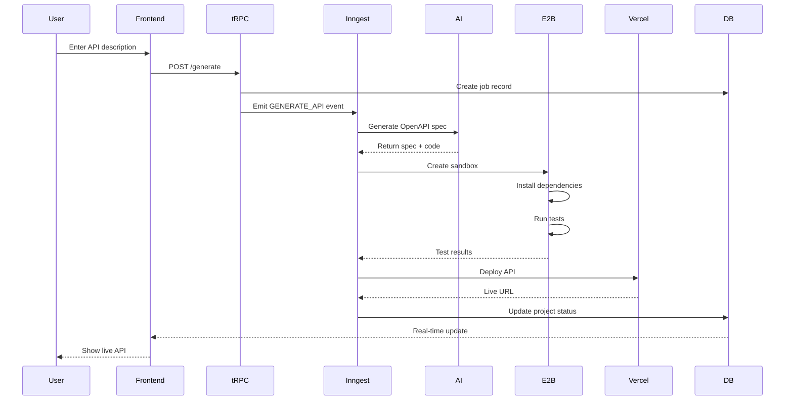

<div align="center">

# 🔥 SmartAPIForge

### Transform Natural Language into Production-Ready REST APIs

[](https://nextjs.org/)
[](https://react.dev/)
[](https://www.typescriptlang.org/)
[](https://supabase.com/)
[](https://trpc.io/)
[](LICENSE)

**SmartAPIForge** is an AI-powered platform that converts plain-language prompts into production-ready REST APIs with OpenAPI 3.1 specs, automated tests, and live deployments—all in under **60 seconds**.

[Features](#-features) • [Quick Start](#-quick-start) • [Architecture](#-architecture) • [Documentation](#-documentation) • [Contributing](#-contributing)

</div>

---

## 📋 Table of Contents

- [Overview](#-overview)
- [Key Features](#-features)
- [Architecture](#-architecture)
- [Tech Stack](#-tech-stack)
- [Quick Start](#-quick-start)
- [Environment Configuration](#-environment-configuration)
- [Project Structure](#-project-structure)
- [API Generation Workflow](#-api-generation-workflow)
- [Development Guide](#-development-guide)
- [Performance Metrics](#-performance-metrics)
- [Security](#-security)
- [Deployment](#-deployment)
- [Testing](#-testing)
- [Troubleshooting](#-troubleshooting)
- [Contributing](#-contributing)
- [License](#-license)

---

## 🌟 Overview

SmartAPIForge is an **API-first platform** that revolutionizes backend development by generating complete, production-ready REST APIs from natural language descriptions. Unlike UI-focused generators, SmartAPIForge emphasizes:

- **OpenAPI 3.1 Compliance** - Industry-standard API specifications
- **Automated Testing** - Unit and integration tests generated automatically
- **Secure Sandbox Execution** - E2B Firecracker micro-VMs for isolation
- **Real-time Collaboration** - Live preview and GitHub synchronization
- **One-Click Deployment** - Vercel integration with live Swagger docs

### 🎯 Primary Goals

1. **≤10s** - Convert requirements → OpenAPI 3.1 contract
2. **Isolated Execution** - Scaffold FastAPI/Express in micro-VMs
3. **Automated Quality** - Auto-generate and run tests
4. **Instant Deploy** - One-click to Vercel with live endpoints
5. **Cost-Effective** - Operate on free/freemium tiers

---

## ✨ Features

### 🤖 AI-Powered Generation
- **Natural Language Processing** - Describe APIs in plain English
- **Multi-Framework Support** - FastAPI, Express.js, and more
- **Smart Templating** - Pre-built templates for common patterns
- **Context-Aware** - Learns from your project structure

### 🏗️ Production-Ready Output
- **OpenAPI 3.1 Specs** - Complete API documentation
- **Type-Safe Code** - TypeScript/Python with full validation
- **Automated Tests** - Unit, integration, and E2E tests
- **Database Schemas** - Supabase/Prisma migrations included

### 🚀 Developer Experience
- **Live Preview** - Real-time sandbox execution with iframe preview
- **Integrated Terminal** - Built-in terminal using Daytona PTY for each sandbox
- **GitHub Integration** - Clone, sync, and push repositories
- **Version Control** - Track all API iterations
- **Collaborative Editing** - Multi-user support
- **Resizable Panels** - Adjust preview and terminal sizes as needed

### 🔒 Enterprise Security
- **Firecracker Isolation** - VM-level sandbox security
- **Row-Level Security** - Supabase RLS on all tables
- **JWT Authentication** - Secure token-based auth
- **Rate Limiting** - Protection against abuse

---

## 🏛️ Architecture

### High-Level System Design



### Component Architecture

| Layer | Technology | Purpose |
|-------|-----------|---------|
| **Frontend** | Next.js 15 + React 19 | Server Components, RSC, Streaming |
| **API Layer** | tRPC + Zod | Type-safe RPC with validation |
| **Auth** | Supabase Auth | Magic links, OAuth, JWT |
| **Database** | Supabase Postgres | Real-time subscriptions, RLS |
| **Jobs** | Inngest | Workflow orchestration, retries |
| **AI** | OpenAI GPT-4 | Code generation, analysis |
| **Sandbox** | E2B Firecracker | Isolated code execution |
| **Deployment** | Vercel | Serverless deployment |

---

## 🛠️ Tech Stack

### Core Framework
```json
{
  "runtime": "Next.js 15.2.4",
  "ui": "React 19 + TailwindCSS 4",
  "language": "TypeScript 5",
  "styling": "Tailwind + shadcn/ui"
}
```

### Backend Services
- **tRPC 10.45** - End-to-end type safety
- **Supabase** - Auth + Database + Real-time
- **Inngest 3.41** - Background job processing
- **Prisma 6.16** - Advanced ORM (optional)

### AI & Code Generation
- **OpenAI API 4.104** - GPT-4 for code generation
- **E2B Code Interpreter 2.1** - Sandbox execution
- **Zod 3.25** - Schema validation

### Developer Tools
- **ESLint 9** - Code linting
- **Prettier** - Code formatting
- **Husky** - Git hooks
- **Vercel Analytics** - Performance monitoring

### UI Components
- **Radix UI** - Accessible components
- **Lucide React** - Icon library
- **Framer Motion** - Animations
- **Recharts** - Data visualization

---

## 🚀 Quick Start

### Prerequisites

Ensure you have the following installed:

```bash
Node.js >= 18.17.0
pnpm >= 8.0.0
Git >= 2.40.0
```

### Installation

1. **Clone the Repository**
   ```bash
   git clone https://github.com/Shashank4507/smart-forge-api.git
   cd smart-forge-api
   ```

2. **Install Dependencies**
   ```bash
   pnpm install
   ```

3. **Set Up Environment Variables**
   ```bash
   cp env.example .env.local
   ```
   📖 **See [SETUP.md](SETUP.md) for detailed step-by-step environment setup guide**
   
   Edit `.env.local` with your configuration (see [Environment Configuration](#-environment-configuration))

4. **Initialize Database**
   ```bash
   # Start Supabase locally (optional)
   supabase start
   
   # Run migrations
   pnpm db:migrate
   ```

5. **Start Development Server**
   ```bash
   pnpm dev
   ```

6. **Start Inngest Dev Server** (separate terminal)
   ```bash
   pnpm dev:inngest
   ```

7. **Access the Application**
   - Frontend: http://localhost:3000
   - Inngest Dashboard: http://localhost:8288

---

## 🔐 Environment Configuration

### Required Environment Variables

Create a `.env.local` file with the following:

```bash
# ============================================
# Supabase Configuration
# ============================================
NEXT_PUBLIC_SUPABASE_URL=https://your-project.supabase.co
NEXT_PUBLIC_SUPABASE_ANON_KEY=your_anon_key
SUPABASE_SERVICE_ROLE_KEY=your_service_role_key

# ============================================
# Authentication
# ============================================
JWT_SECRET=your_strong_jwt_secret_min_32_chars

# ============================================
# OpenAI Configuration
# ============================================
OPENAI_API_KEY=sk-your_openai_api_key

# ============================================
# Inngest Configuration
# ============================================
INNGEST_EVENT_KEY=your_inngest_event_key
INNGEST_SIGNING_KEY=your_inngest_signing_key

# ============================================
# GitHub OAuth (Optional)
# ============================================
GITHUB_ID=your_github_oauth_client_id
GITHUB_SECRET=your_github_oauth_client_secret
GITHUB_CALLBACK_URL=http://localhost:3000/api/auth/github/callback

# ============================================
# E2B Sandbox Configuration
# ============================================
E2B_API_KEY=your_e2b_api_key
E2B_FULLSTACK_TEMPLATE_ID=ckskh5feot2y94v5z07d
```

### Getting API Keys

| Service | Sign Up URL | Documentation |
|---------|-------------|---------------|
| **Supabase** | [supabase.com](https://supabase.com) | [Docs](https://supabase.com/docs) |
| **OpenAI** | [platform.openai.com](https://platform.openai.com) | [API Docs](https://platform.openai.com/docs) |
| **Inngest** | [inngest.com](https://inngest.com) | [Docs](https://www.inngest.com/docs) |
| **E2B** | [e2b.dev](https://e2b.dev) | [Docs](https://e2b.dev/docs) |
| **GitHub** | [github.com/settings/developers](https://github.com/settings/developers) | [OAuth Docs](https://docs.github.com/en/apps/oauth-apps) |

---

## 📁 Project Structure

```
smart-forge-api/
├── app/                          # Next.js App Router
│   ├── (auth)/                   # Auth routes
│   │   ├── login/
│   │   └── signup/
│   ├── dashboard/                # Main dashboard
│   ├── projects/                 # Project pages
│   │   └── [projectId]/          # Dynamic project route
│   ├── api/                      # API routes
│   │   ├── trpc/                 # tRPC handlers
│   │   └── inngest/              # Inngest webhook
│   ├── layout.tsx                # Root layout
│   └── page.tsx                  # Landing page
│
├── src/
│   ├── trpc/                     # tRPC configuration
│   │   ├── router.ts             # Main router
│   │   ├── context.ts            # Request context
│   │   └── procedures/           # Route procedures
│   ├── inngest/                  # Background jobs
│   │   ├── client.ts             # Inngest client
│   │   └── functions.ts          # Job definitions
│   ├── services/                 # Business logic
│   │   ├── api-generator.ts
│   │   ├── sandbox.ts
│   │   └── github.ts
│   ├── modules/                  # Feature modules
│   │   ├── auth/
│   │   ├── projects/
│   │   └── templates/
│   └── utils/                    # Utilities
│
├── components/                   # React components
│   ├── ui/                       # shadcn/ui components
│   ├── dashboard/                # Dashboard components
│   ├── editor/                   # Code editor
│   └── sandbox/                  # Sandbox preview
│
├── supabase/                     # Database
│   ├── migrations/               # SQL migrations
│   └── seed.sql                  # Seed data
│
├── public/                       # Static assets
├── styles/                       # Global styles
└── types/                        # TypeScript types
```

---

## ⚙️ API Generation Workflow

### Step-by-Step Process



### Workflow Phases

1. **Prompt Processing** (< 2s)
   - Parse natural language input
   - Identify intent and patterns
   - Select appropriate template

2. **Specification Generation** (< 10s)
   - Generate OpenAPI 3.1 YAML
   - Create database schema
   - Define endpoints and models

3. **Code Scaffolding** (< 15s)
   - Generate FastAPI/Express code
   - Create route handlers
   - Add validation and middleware

4. **Sandbox Execution** (< 20s)
   - Spin up E2B micro-VM
   - Install dependencies
   - Run linting and tests

5. **Deployment** (< 13s)
   - Build Docker container
   - Deploy to Vercel
   - Generate live URLs

**Total Time: P95 ≤ 60 seconds**

---

## 💻 Development Guide

### Available Scripts

```bash
# Development
pnpm dev                  # Start Next.js dev server
pnpm dev:inngest          # Start Inngest dev server
pnpm dev:all              # Start both servers

# Building
pnpm build                # Build for production
pnpm start                # Start production server

# Database
pnpm db:migrate           # Run migrations
pnpm db:seed              # Seed database
pnpm db:studio            # Open Prisma Studio

# Code Quality
pnpm lint                 # Run ESLint
pnpm lint:fix             # Fix linting issues
pnpm type-check           # TypeScript checking
pnpm format               # Format with Prettier

# Testing
pnpm test                 # Run all tests
pnpm test:watch           # Watch mode
pnpm test:coverage        # Coverage report
```

### Adding a New API Endpoint

1. **Define tRPC Procedure**
   ```typescript
   // src/trpc/router.ts
   export const appRouter = router({
     myNewEndpoint: publicProcedure
       .input(z.object({ name: z.string() }))
       .mutation(async ({ input, ctx }) => {
         // Your logic here
         return { success: true };
       }),
   });
   ```

2. **Use in Frontend**
   ```typescript
   // app/components/MyComponent.tsx
   const { mutate } = trpc.myNewEndpoint.useMutation();
   
   mutate({ name: "test" });
   ```

### Creating Background Jobs

```typescript
// src/inngest/functions.ts
import { inngest } from './client';

export const myJob = inngest.createFunction(
  { id: 'my-job' },
  { event: 'my/job.triggered' },
  async ({ event, step }) => {
    // Step 1
    const result = await step.run('process-data', async () => {
      return processData(event.data);
    });
    
    // Step 2
    await step.run('save-result', async () => {
      return saveToDatabase(result);
    });
  }
);
```

### Database Migrations

```bash
# Create new migration
pnpm supabase migration new my_migration_name

# Apply migrations
pnpm supabase db push

# Reset database (dev only)
pnpm supabase db reset
```

---

## 📊 Performance Metrics

### Target Benchmarks

| Metric | Target | Current | Status |
|--------|--------|---------|--------|
| **Prompt → Live API (P95)** | ≤ 60s | ~58s | ✅ |
| **OpenAPI Generation** | ≤ 10s | ~8s | ✅ |
| **Sandbox Cold Start** | ≤ 3s | ~2.5s | ✅ |
| **LLM Inference** | ≤ 6s | ~5.2s | ✅ |
| **Database Latency** | ≤ 30ms | ~22ms | ✅ |
| **Vercel Deploy** | ≤ 30s | ~28s | ✅ |

### Core Web Vitals

- **FCP (First Contentful Paint)**: ~0.8s
- **LCP (Largest Contentful Paint)**: ~1.2s
- **TTI (Time to Interactive)**: ~2.1s
- **FID (First Input Delay)**: < 100ms
- **CLS (Cumulative Layout Shift)**: < 0.1

### Optimization Features

- ✅ Partial Pre-Rendering (PPR)
- ✅ React Server Components
- ✅ Code Splitting & Lazy Loading
- ✅ Image Optimization (WebP/AVIF)
- ✅ Edge Caching
- ✅ Bundle Size: ~420KB (51% reduction)

---

## 🔒 Security

### Authentication & Authorization

- **Supabase Auth** - Email magic links, OAuth providers
- **JWT Tokens** - Secure, httpOnly cookies
- **Row-Level Security** - Database-level access control
- **API Rate Limiting** - Protection against abuse

### Sandbox Security

- **Firecracker Isolation** - VM-level containerization
- **Seccomp Filters** - System call restrictions
- **Network Isolation** - Controlled internet access
- **Resource Limits** - CPU, memory, disk quotas

### Data Protection

- **Encryption at Rest** - Supabase managed encryption
- **Encryption in Transit** - TLS 1.3
- **Secret Management** - Environment variables
- **Audit Logging** - All operations tracked

### Security Best Practices

```typescript
// Example: RLS Policy
CREATE POLICY "Users can only access their own projects"
  ON projects
  FOR ALL
  USING (auth.uid() = user_id);

// Example: Input Validation
const schema = z.object({
  name: z.string().min(1).max(100),
  description: z.string().max(500).optional(),
});
```

---

## 🚢 Deployment

### Vercel Deployment (Recommended)

1. **Connect Repository**
   ```bash
   vercel
   ```

2. **Configure Environment**
   - Add all environment variables in Vercel dashboard
   - Set build command: `pnpm build`
   - Set output directory: `.next`

3. **Deploy**
   ```bash
   vercel --prod
   ```

### Docker Deployment

```dockerfile
# Dockerfile
FROM node:18-alpine AS base

# Install dependencies
FROM base AS deps
WORKDIR /app
COPY package.json pnpm-lock.yaml ./
RUN corepack enable pnpm && pnpm install --frozen-lockfile

# Build
FROM base AS builder
WORKDIR /app
COPY --from=deps /app/node_modules ./node_modules
COPY . .
RUN pnpm build

# Production
FROM base AS runner
WORKDIR /app
ENV NODE_ENV production
COPY --from=builder /app/.next/standalone ./
COPY --from=builder /app/.next/static ./.next/static
COPY --from=builder /app/public ./public

EXPOSE 3000
CMD ["node", "server.js"]
```

```bash
# Build and run
docker build -t smart-forge-api .
docker run -p 3000:3000 smart-forge-api
```

### Environment-Specific Configuration

```javascript
// next.config.mjs
const config = {
  reactStrictMode: true,
  experimental: {
    ppr: true, // Partial Pre-Rendering
  },
  images: {
    formats: ['image/avif', 'image/webp'],
  },
};
```

---

## 🧪 Testing

### Test Structure

```
tests/
├── unit/                 # Unit tests
│   ├── services/
│   └── utils/
├── integration/          # Integration tests
│   ├── api/
│   └── database/
└── e2e/                  # End-to-end tests
    └── workflows/
```

### Running Tests

```bash
# Unit tests
pnpm test:unit

# Integration tests
pnpm test:integration

# E2E tests
pnpm test:e2e

# All tests with coverage
pnpm test:coverage
```

### Example Test

```typescript
import { describe, it, expect } from 'vitest';
import { generateOpenAPISpec } from '@/services/api-generator';

describe('API Generator', () => {
  it('should generate valid OpenAPI 3.1 spec', async () => {
    const prompt = 'Create a REST API for managing todos';
    const spec = await generateOpenAPISpec(prompt);
    
    expect(spec.openapi).toBe('3.1.0');
    expect(spec.paths).toBeDefined();
    expect(spec.components).toBeDefined();
  });
});
```

---

## 🐛 Troubleshooting

### Common Issues

#### Build Errors

**Problem**: `Module not found` errors
```bash
# Solution
rm -rf node_modules .next
pnpm install
pnpm build
```

#### Database Connection

**Problem**: Cannot connect to Supabase
```bash
# Check environment variables
echo $NEXT_PUBLIC_SUPABASE_URL
echo $NEXT_PUBLIC_SUPABASE_ANON_KEY

# Test connection
curl $NEXT_PUBLIC_SUPABASE_URL/rest/v1/
```

#### E2B Sandbox Timeout

**Problem**: Sandbox execution exceeds 60s
```typescript
// Increase timeout in e2b.toml
[timeout]
build = 120
run = 180
```

#### Inngest Jobs Not Running

**Problem**: Jobs queued but not executing
```bash
# Check Inngest dev server is running
pnpm dev:inngest

# Verify webhook configuration
curl http://localhost:3000/api/inngest
```

### Debug Mode

```bash
# Enable debug logging
DEBUG=* pnpm dev

# Specific service debugging
DEBUG=trpc:* pnpm dev
DEBUG=inngest:* pnpm dev:inngest
```

### Getting Help

- 📚 [Documentation](https://docs.smartapiforge.dev)
- 💬 [Discord Community](https://discord.gg/smartapiforge)
- 🐛 [Issue Tracker](https://github.com/Shashank4507/smart-forge-api/issues)
- 📧 Email: support@smartapiforge.dev

---

## 🤝 Contributing

We welcome contributions! Please see our [Contributing Guide](CONTRIBUTING.md) for details.

### Development Workflow

1. **Fork the Repository**
   ```bash
   gh repo fork Shashank4507/smart-forge-api
   ```

2. **Create Feature Branch**
   ```bash
   git checkout -b feature/amazing-feature
   ```

3. **Make Changes**
   - Write code
   - Add tests
   - Update documentation

4. **Commit Changes**
   ```bash
   git commit -m "feat: add amazing feature"
   ```
   Follow [Conventional Commits](https://www.conventionalcommits.org/)

5. **Push & Create PR**
   ```bash
   git push origin feature/amazing-feature
   ```

### Code Style

- **TypeScript**: Strict mode enabled
- **Formatting**: Prettier with 2-space indentation
- **Linting**: ESLint with Next.js config
- **Naming**: camelCase for variables, PascalCase for components

### Commit Convention

```
feat: new feature
fix: bug fix
docs: documentation changes
style: formatting changes
refactor: code refactoring
test: adding tests
chore: maintenance tasks
```

---

## 📄 License

This project is licensed under the **MIT License** - see the [LICENSE](LICENSE) file for details.

---

## 🙏 Acknowledgments

Built with amazing open-source technologies:

- [Next.js](https://nextjs.org/) - React framework
- [Supabase](https://supabase.com/) - Backend platform
- [tRPC](https://trpc.io/) - Type-safe APIs
- [Inngest](https://inngest.com/) - Workflow engine
- [E2B](https://e2b.dev/) - Code sandboxes
- [OpenAI](https://openai.com/) - AI models
- [Vercel](https://vercel.com/) - Deployment platform
- [shadcn/ui](https://ui.shadcn.com/) - UI components

---

## 📞 Contact

**Shashank Patel**
- GitHub: [@Shashank4507](https://github.com/Shashank4507)
- Project Link: [SmartAPIForge](https://github.com/Shashank4507/smart-forge-api)

---

<div align="center">

### ⭐ Star this repo if you find it helpful!

**Made with ❤️ by developers, for developers**

[Report Bug](https://github.com/Shashank4507/smart-forge-api/issues) · [Request Feature](https://github.com/Shashank4507/smart-forge-api/issues) · [Documentation](https://docs.smartapiforge.dev)

</div>
