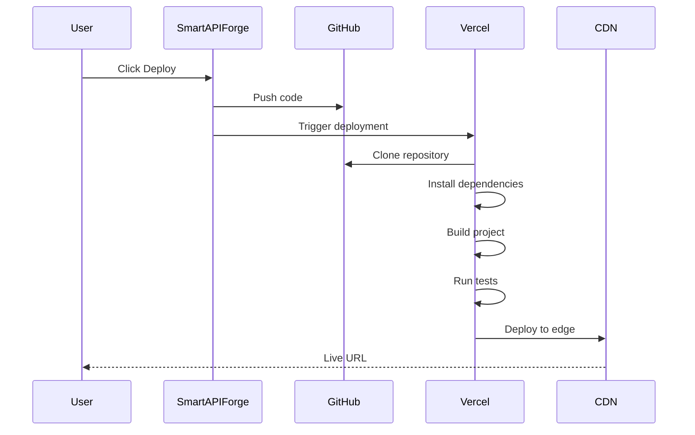

# Deployment

Deploy your SmartAPIForge-generated APIs to production with one-click integrations to popular hosting platforms.

## Key Features

- One-click Vercel deployment
- AWS Lambda functions
- Docker containerization
- Custom server deployment
- Automatic CI/CD from GitHub
- Environment variable management
- Custom domain support

## Deployment Options

SmartAPIForge supports multiple deployment platforms:

<CardGrid cols={3}>
  <Card title="Vercel">
    Serverless deployment with automatic scaling
  </Card>
  <Card title="Fly.io">
    Global edge deployment with persistent storage
  </Card>
  <Card title="Railway">
    Simple deployment with built-in databases
  </Card>
</CardGrid>

## Vercel Deployment

### Overview

Vercel provides:
- ⚡ Instant deployments (< 30 seconds)
- 🌍 Global CDN with edge functions
- 🔄 Automatic CI/CD from GitHub
- 📊 Built-in analytics and monitoring
- 🆓 Generous free tier

<Callout type="info" title="Recommended Platform">
  Vercel is the recommended platform for SmartAPIForge projects due to its seamless integration and excellent performance.
</Callout>

### Connect Vercel Account

First-time setup:

1. Click the **Publish** button (Vercel logo) in project header
2. Click **Connect Vercel Account**
3. Authorize SmartAPIForge on Vercel
4. Grant deployment permissions

<Callout type="success" title="Connected">
  Your Vercel account is now connected! You can deploy projects with one click.
</Callout>

### Deploy Your First Project

Deploy in under 2 minutes:

1. Open your project in SmartAPIForge
2. Click **Publish** button
3. Review deployment settings:
   - **Project Name:** my-api-project
   - **Framework:** FastAPI / Express / Next.js
   - **Build Command:** Auto-detected
   - **Output Directory:** Auto-detected
4. Click **Deploy to Vercel**
5. Wait ~1-2 minutes for deployment
6. Click **View Live Site**

Your API is now live at `https://your-project.vercel.app`!

### Deployment Process

What happens during deployment:



**Timeline:**
- Push to GitHub: ~2s
- Clone repository: ~5s
- Install dependencies: ~10-20s
- Build project: ~5-10s
- Deploy to edge: ~5s
- **Total:** ~30-45s

### Environment Variables

Configure environment variables for production:

1. Go to Vercel dashboard
2. Select your project
3. Click **Settings** → **Environment Variables**
4. Add variables:

```env
# Database
DATABASE_URL=postgresql://...

# API Keys
OPENAI_API_KEY=sk-...
STRIPE_SECRET_KEY=sk_live_...

# Authentication
JWT_SECRET=your-production-secret
NEXTAUTH_URL=https://your-domain.com

# Feature Flags
ENABLE_ANALYTICS=true
ENABLE_RATE_LIMITING=true
```

<Callout type="warning" title="Production Secrets">
  Never use development secrets in production. Generate new, secure secrets for production environments.
</Callout>

### Custom Domains

Use your own domain:

1. Go to Vercel dashboard
2. Select your project
3. Click **Settings** → **Domains**
4. Add your domain:
   ```
   api.yourdomain.com
   ```
5. Configure DNS records:
   ```
   Type: CNAME
   Name: api
   Value: cname.vercel-dns.com
   ```
6. Wait for DNS propagation (~5-60 minutes)

Your API is now available at `https://api.yourdomain.com`!

### Automatic Deployments

Enable automatic deployments from GitHub:

1. Connect GitHub repository to Vercel
2. Configure deployment branches:
   - **Production:** `main` branch
   - **Preview:** All other branches
3. Every push triggers automatic deployment

**Branch Deployments:**
- `main` → Production (`your-project.vercel.app`)
- `develop` → Preview (`develop-your-project.vercel.app`)
- `feature/*` → Preview (`feature-branch-your-project.vercel.app`)

<Callout type="success" title="Preview Deployments">
  Every pull request gets its own preview URL for testing before merging.
</Callout>

### Deployment Logs

View deployment logs:

1. Go to Vercel dashboard
2. Select your project
3. Click **Deployments**
4. Click on a deployment
5. View build logs, runtime logs, and errors

### Rollback Deployments

Rollback to a previous version:

1. Go to Vercel dashboard
2. Click **Deployments**
3. Find the working deployment
4. Click **⋯** → **Promote to Production**

The previous version is instantly restored.

## Fly.io Deployment

### Overview

Fly.io provides:
- 🌍 Global edge deployment
- 💾 Persistent storage with volumes
- 🐳 Full Docker support
- 🔒 Private networking
- 🆓 Free tier with 3 VMs

### Deploy to Fly.io

1. Install Fly CLI:
   ```bash
   curl -L https://fly.io/install.sh | sh
   ```

2. Login to Fly:
   ```bash
   fly auth login
   ```

3. Download your project code from SmartAPIForge

4. Create `fly.toml`:
   ```toml
   app = "my-api-project"
   
   [build]
     builder = "paketobuildpacks/builder:base"
   
   [[services]]
     internal_port = 8000
     protocol = "tcp"
   
     [[services.ports]]
       port = 80
       handlers = ["http"]
     
     [[services.ports]]
       port = 443
       handlers = ["tls", "http"]
   ```

5. Deploy:
   ```bash
   fly deploy
   ```

Your API is now live at `https://my-api-project.fly.dev`!

### Persistent Storage

Add persistent volumes:

```bash
# Create volume
fly volumes create data --size 10

# Update fly.toml
[mounts]
  source = "data"
  destination = "/data"

# Deploy
fly deploy
```

## Railway Deployment

### Overview

Railway provides:
- 🚂 Simple deployment from GitHub
- 🗄️ Built-in PostgreSQL, Redis, MongoDB
- 📊 Automatic metrics and logs
- 💳 Pay-as-you-go pricing
- 🆓 $5 free credit monthly

### Deploy to Railway

1. Go to [railway.app](https://railway.app)
2. Click **New Project**
3. Select **Deploy from GitHub repo**
4. Choose your SmartAPIForge repository
5. Railway auto-detects settings
6. Click **Deploy**

Your API is live at `https://your-project.up.railway.app`!

### Add Database

Add a PostgreSQL database:

1. Click **New** → **Database** → **PostgreSQL**
2. Railway provisions database
3. Connection string added to environment variables automatically
4. Redeploy to use database

## Docker Deployment

### Build Docker Image

SmartAPIForge generates a Dockerfile:

```dockerfile
FROM python:3.11-slim

WORKDIR /app

# Install dependencies
COPY requirements.txt .
RUN pip install --no-cache-dir -r requirements.txt

# Copy application
COPY . .

# Expose port
EXPOSE 8000

# Run application
CMD ["uvicorn", "main:app", "--host", "0.0.0.0", "--port", "8000"]
```

Build and run:

```bash
# Build image
docker build -t my-api .

# Run container
docker run -p 8000:8000 my-api

# Test
curl http://localhost:8000/docs
```

### Docker Compose

For multi-service deployments:

```yaml
version: '3.8'

services:
  api:
    build: .
    ports:
      - "8000:8000"
    environment:
      - DATABASE_URL=postgresql://postgres:password@db:5432/mydb
    depends_on:
      - db
  
  db:
    image: postgres:15
    environment:
      - POSTGRES_PASSWORD=password
      - POSTGRES_DB=mydb
    volumes:
      - postgres_data:/var/lib/postgresql/data

volumes:
  postgres_data:
```

Run with:

```bash
docker-compose up -d
```

## Deployment Best Practices

### Pre-Deployment Checklist

Before deploying to production:

- [ ] All tests passing
- [ ] Environment variables configured
- [ ] Database migrations applied
- [ ] API documentation updated
- [ ] Error handling implemented
- [ ] Rate limiting configured
- [ ] Logging set up
- [ ] Monitoring enabled
- [ ] Security headers configured
- [ ] CORS configured correctly

### Security Hardening

Secure your production API:

```python
# Add security headers
from fastapi.middleware.cors import CORSMiddleware
from fastapi.middleware.trustedhost import TrustedHostMiddleware

app.add_middleware(
    CORSMiddleware,
    allow_origins=["https://yourdomain.com"],
    allow_credentials=True,
    allow_methods=["GET", "POST", "PUT", "DELETE"],
    allow_headers=["*"],
)

app.add_middleware(
    TrustedHostMiddleware,
    allowed_hosts=["yourdomain.com", "*.yourdomain.com"]
)
```

### Performance Optimization

Optimize for production:

```python
# Enable caching
from fastapi_cache import FastAPICache
from fastapi_cache.backends.redis import RedisBackend

@app.on_event("startup")
async def startup():
    redis = aioredis.from_url("redis://localhost")
    FastAPICache.init(RedisBackend(redis), prefix="api-cache")

# Add response caching
@app.get("/users")
@cache(expire=60)
async def get_users():
    return await User.find_all()
```

### Monitoring

Set up monitoring:

```python
# Add health check endpoint
@app.get("/health")
async def health_check():
    return {
        "status": "healthy",
        "timestamp": datetime.now().isoformat(),
        "version": "1.0.0"
    }

# Add metrics endpoint
@app.get("/metrics")
async def metrics():
    return {
        "requests_total": request_counter,
        "requests_per_second": calculate_rps(),
        "average_response_time": calculate_avg_response_time()
    }
```

### Logging

Configure production logging:

```python
import logging

# Configure logging
logging.basicConfig(
    level=logging.INFO,
    format='%(asctime)s - %(name)s - %(levelname)s - %(message)s',
    handlers=[
        logging.FileHandler('app.log'),
        logging.StreamHandler()
    ]
)

logger = logging.getLogger(__name__)

# Log requests
@app.middleware("http")
async def log_requests(request: Request, call_next):
    logger.info(f"{request.method} {request.url}")
    response = await call_next(request)
    logger.info(f"Status: {response.status_code}")
    return response
```

## Troubleshooting

### Deployment Failed

**Problem:** Deployment fails with build error

**Solutions:**
1. Check build logs for specific error
2. Verify all dependencies are in requirements.txt
3. Ensure Python version matches (3.11)
4. Test build locally with Docker

### Environment Variables Not Working

**Problem:** API can't access environment variables

**Solutions:**
1. Verify variables are set in platform dashboard
2. Check variable names match exactly
3. Restart deployment after adding variables
4. Use platform-specific variable syntax

### Database Connection Failed

**Problem:** Cannot connect to database

**Solutions:**
1. Verify DATABASE_URL is correct
2. Check database is accessible from deployment
3. Ensure database allows connections from deployment IP
4. Test connection locally first

### Slow Response Times

**Problem:** API responds slowly in production

**Solutions:**
1. Enable caching for expensive operations
2. Optimize database queries
3. Add database indexes
4. Use CDN for static assets
5. Enable compression

## Next Steps

<CardGrid cols={2}>
  <Card
    title="Monitoring Guide"
    description="Set up monitoring and alerts"
    href="/docs/guides/monitoring"
  />
  <Card
    title="Scaling Guide"
    description="Scale your API for high traffic"
    href="/docs/guides/scaling"
  />
  <Card
    title="Security Guide"
    description="Secure your production API"
    href="/docs/guides/security"
  />
  <Card
    title="CI/CD Guide"
    description="Automate deployments"
    href="/docs/guides/cicd"
  />
</CardGrid>

## Learn More

- [Vercel Documentation](https://vercel.com/docs)
- [Fly.io Documentation](https://fly.io/docs)
- [Railway Documentation](https://docs.railway.app)
- [Docker Best Practices](https://docs.docker.com/develop/dev-best-practices/)
