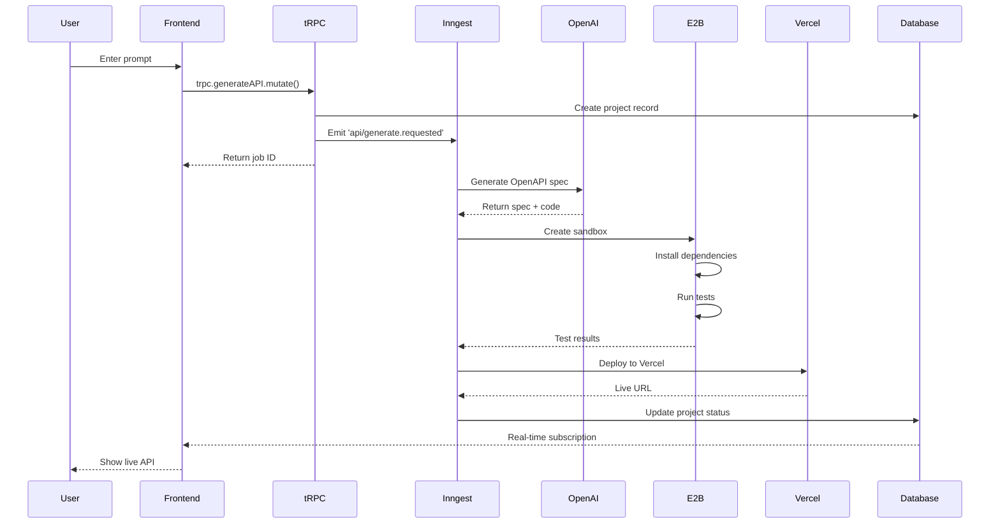
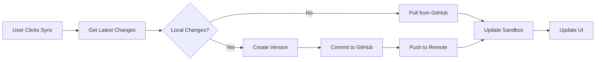

# SmartAPIForge Architecture

## 🏗️ System Architecture Overview

SmartAPIForge is built on a modern, scalable architecture that leverages Next.js 15, Supabase, and E2B sandboxes to deliver production-ready APIs from natural language prompts.

## 📊 High-Level Architecture

```
┌─────────────────────────────────────────────────────────────────┐
│                        Client Layer                              │
│  ┌──────────────┐  ┌──────────────┐  ┌──────────────┐          │
│  │  Dashboard   │  │  Editor      │  │  Preview     │          │
│  │  (React 19)  │  │  (Monaco)    │  │  (E2B)       │          │
│  └──────────────┘  └──────────────┘  └──────────────┘          │
└─────────────────────────────────────────────────────────────────┘
                           ▼
┌─────────────────────────────────────────────────────────────────┐
│                      Application Layer                           │
│  ┌──────────────────────────────────────────────────────────┐   │
│  │           Next.js 15 App Router (RSC)                    │   │
│  │  ┌────────────┐  ┌────────────┐  ┌────────────┐        │   │
│  │  │  Server    │  │  Client    │  │  API       │        │   │
│  │  │  Components│  │  Components│  │  Routes    │        │   │
│  │  └────────────┘  └────────────┘  └────────────┘        │   │
│  └──────────────────────────────────────────────────────────┘   │
└─────────────────────────────────────────────────────────────────┘
                           ▼
┌─────────────────────────────────────────────────────────────────┐
│                        API Layer (tRPC)                          │
│  ┌──────────────┐  ┌──────────────┐  ┌──────────────┐          │
│  │  Procedures  │  │  Middleware  │  │  Context     │          │
│  │  (Zod)       │  │  (Auth)      │  │  Builder     │          │
│  └──────────────┘  └──────────────┘  └──────────────┘          │
└─────────────────────────────────────────────────────────────────┘
                           ▼
┌─────────────────────────────────────────────────────────────────┐
│                      Business Logic Layer                        │
│  ┌──────────────┐  ┌──────────────┐  ┌──────────────┐          │
│  │  Services    │  │  Modules     │  │  Utils       │          │
│  └──────────────┘  └──────────────┘  └──────────────┘          │
└─────────────────────────────────────────────────────────────────┘
                           ▼
┌─────────────────────────────────────────────────────────────────┐
│                      Infrastructure Layer                        │
│  ┌──────────────┐  ┌──────────────┐  ┌──────────────┐          │
│  │  Supabase    │  │  Inngest     │  │  OpenAI      │          │
│  │  (DB+Auth)   │  │  (Jobs)      │  │  (AI)        │          │
│  └──────────────┘  └──────────────┘  └──────────────┘          │
│  ┌──────────────┐  ┌──────────────┐                             │
│  │  E2B         │  │  Vercel      │                             │
│  │  (Sandbox)   │  │  (Deploy)    │                             │
│  └──────────────┘  └──────────────┘                             │
└─────────────────────────────────────────────────────────────────┘
```

---

## 🎯 Core Components

### 1. Frontend Layer

#### Next.js App Router
- **Server Components**: Render on server, reduce bundle size
- **Client Components**: Interactive UI with React 19
- **Streaming**: Progressive rendering with Suspense
- **Partial Pre-Rendering (PPR)**: Hybrid static/dynamic content

#### Key Technologies
```typescript
// Server Component Example
async function ProjectPage({ params }: { params: { id: string } }) {
  const project = await getProject(params.id); // Server-side
  return <ProjectClient project={project} />;
}

// Client Component Example
'use client';
function ProjectClient({ project }: { project: Project }) {
  const [code, setCode] = useState(project.code);
  // Interactive logic here
}
```

### 2. API Layer (tRPC)

#### Router Structure
```
src/trpc/
├── router.ts              # Main router
├── context.ts             # Request context builder
└── procedures/
    ├── projects.ts        # Project operations
    ├── templates.ts       # Template management
    ├── github.ts          # GitHub integration
    └── auth.ts            # Authentication
```

#### Type-Safe Procedures
```typescript
export const projectRouter = router({
  create: protectedProcedure
    .input(z.object({
      name: z.string(),
      description: z.string().optional(),
    }))
    .mutation(async ({ input, ctx }) => {
      // Type-safe throughout
      return await createProject(input, ctx.user.id);
    }),
});
```

### 3. Background Jobs (Inngest)

#### Job Workflow
```typescript
// API Generation Workflow
export const generateAPI = inngest.createFunction(
  { id: 'generate-api', concurrency: 5 },
  { event: 'api/generate.requested' },
  async ({ event, step }) => {
    // Step 1: Generate OpenAPI spec
    const spec = await step.run('generate-spec', async () => {
      return await openai.generateSpec(event.data.prompt);
    });

    // Step 2: Create sandbox
    const sandbox = await step.run('create-sandbox', async () => {
      return await e2b.create({ spec });
    });

    // Step 3: Run tests
    const tests = await step.run('run-tests', async () => {
      return await sandbox.runTests();
    });

    // Step 4: Deploy
    const url = await step.run('deploy', async () => {
      return await vercel.deploy(sandbox.files);
    });

    return { spec, url, tests };
  }
);
```

### 4. Database Layer (Supabase)

#### Schema Structure
```sql
-- Core Tables
users (
  id UUID PRIMARY KEY,
  email TEXT UNIQUE,
  created_at TIMESTAMPTZ
)

projects (
  id UUID PRIMARY KEY,
  user_id UUID REFERENCES users,
  name TEXT,
  framework TEXT,
  status TEXT,
  created_at TIMESTAMPTZ
)

versions (
  id UUID PRIMARY KEY,
  project_id UUID REFERENCES projects,
  version_number INT,
  code TEXT,
  spec JSONB,
  created_at TIMESTAMPTZ
)

github_repos (
  id UUID PRIMARY KEY,
  project_id UUID REFERENCES projects,
  repo_name TEXT,
  owner TEXT,
  last_synced TIMESTAMPTZ
)
```

#### Row-Level Security
```sql
-- Users can only access their own projects
CREATE POLICY "Users access own projects"
  ON projects FOR ALL
  USING (auth.uid() = user_id);

-- Users can read their own versions
CREATE POLICY "Users read own versions"
  ON versions FOR SELECT
  USING (
    EXISTS (
      SELECT 1 FROM projects
      WHERE projects.id = versions.project_id
      AND projects.user_id = auth.uid()
    )
  );
```

---

## 🔄 Data Flow

### 1. API Generation Flow



### 2. GitHub Sync Flow



---

## 🔐 Security Architecture

### Authentication Flow

```typescript
// 1. User signs in
const { data, error } = await supabase.auth.signInWithOtp({
  email: 'user@example.com'
});

// 2. Verify magic link
const { data: { session } } = await supabase.auth.getSession();

// 3. Create tRPC context with user
const createContext = async () => {
  const session = await getSession();
  return { user: session?.user, db: supabase };
};

// 4. Protect procedures
const protectedProcedure = publicProcedure.use(async ({ ctx, next }) => {
  if (!ctx.user) throw new TRPCError({ code: 'UNAUTHORIZED' });
  return next({ ctx: { ...ctx, user: ctx.user } });
});
```

### Sandbox Isolation

```typescript
// E2B Security Configuration
const sandbox = await e2b.create({
  template: 'base',
  // Resource limits
  timeoutMs: 60000,
  memory: 512, // MB
  cpu: 1, // cores
  
  // Network isolation
  networking: {
    allowedDomains: ['api.openai.com', 'npmjs.org'],
    blockPrivateIPs: true,
  },
  
  // Filesystem restrictions
  filesystem: {
    readOnly: ['/usr', '/lib'],
    writeableSize: 100, // MB
  },
});
```

---

## 📦 Module Organization

### Service Layer Pattern

```typescript
// services/api-generator.ts
export class APIGenerator {
  constructor(
    private openai: OpenAI,
    private db: Database,
    private sandbox: E2BClient
  ) {}

  async generate(prompt: string, userId: string): Promise<Project> {
    // 1. Validate input
    const validated = this.validate(prompt);
    
    // 2. Generate spec
    const spec = await this.generateSpec(validated);
    
    // 3. Generate code
    const code = await this.generateCode(spec);
    
    // 4. Create project
    return await this.createProject({
      userId,
      spec,
      code,
    });
  }

  private async generateSpec(prompt: string) {
    // OpenAI integration
  }

  private async generateCode(spec: OpenAPISpec) {
    // Code generation
  }
}
```

### Module Structure

```
src/modules/
├── auth/
│   ├── hooks/
│   │   └── useAuth.ts
│   ├── components/
│   │   └── AuthProvider.tsx
│   └── utils/
│       └── session.ts
├── projects/
│   ├── hooks/
│   │   └── useProject.ts
│   ├── components/
│   │   └── ProjectCard.tsx
│   └── services/
│       └── projectService.ts
└── editor/
    ├── hooks/
    │   └── useEditor.ts
    └── components/
        └── CodeEditor.tsx
```

---

## 🚀 Performance Optimizations

### 1. Code Splitting

```typescript
// Dynamic imports for heavy components
const CodeEditor = dynamic(() => import('@/components/CodeEditor'), {
  loading: () => <EditorSkeleton />,
  ssr: false, // Client-side only
});

const ThreeDOrb = dynamic(() => import('@/components/ThreeDOrb'), {
  loading: () => <div>Loading 3D...</div>,
  ssr: false,
});
```

### 2. React Server Components

```typescript
// Server Component - No JS sent to client
async function ProjectList() {
  const projects = await getProjects(); // Server-side fetch
  
  return (
    <div>
      {projects.map(p => (
        <ProjectCard key={p.id} project={p} />
      ))}
    </div>
  );
}

// Client Component - Only where needed
'use client';
function ProjectCard({ project }: { project: Project }) {
  const [starred, setStarred] = useState(false);
  // Interactive features
}
```

### 3. Caching Strategy

```typescript
// Next.js Cache Configuration
export const revalidate = 60; // Revalidate every 60s

// tRPC with React Query caching
const { data: projects } = trpc.projects.list.useQuery(undefined, {
  staleTime: 60000, // 1 minute
  cacheTime: 300000, // 5 minutes
});

// Supabase with edge caching
const { data } = await supabase
  .from('projects')
  .select()
  .limit(10)
  .single();
```

---

## 🔧 Development Workflow

### Local Development

```bash
# 1. Start Supabase (optional local instance)
supabase start

# 2. Start Next.js dev server
pnpm dev

# 3. Start Inngest dev server (separate terminal)
pnpm dev:inngest

# 4. Run tests in watch mode (optional)
pnpm test:watch
```

### Environment Setup

```typescript
// env.validation.ts
import { z } from 'zod';

const envSchema = z.object({
  NEXT_PUBLIC_SUPABASE_URL: z.string().url(),
  NEXT_PUBLIC_SUPABASE_ANON_KEY: z.string(),
  OPENAI_API_KEY: z.string(),
  E2B_API_KEY: z.string(),
});

export const env = envSchema.parse(process.env);
```

---

## 📊 Monitoring & Observability

### Metrics Collection

```typescript
// Performance monitoring
export async function trackMetric(
  metric: string,
  value: number,
  tags?: Record<string, string>
) {
  await analytics.track({
    metric,
    value,
    tags,
    timestamp: Date.now(),
  });
}

// Usage
await trackMetric('api.generation.duration', duration, {
  framework: 'fastapi',
  status: 'success',
});
```

### Error Tracking

```typescript
// Error boundary with logging
export function ErrorBoundary({ children }: { children: ReactNode }) {
  useEffect(() => {
    const handler = (error: Error) => {
      logger.error('Unhandled error', {
        message: error.message,
        stack: error.stack,
        timestamp: new Date().toISOString(),
      });
    };
    
    window.addEventListener('error', handler);
    return () => window.removeEventListener('error', handler);
  }, []);
  
  return <>{children}</>;
}
```

---

## 🎯 Design Principles

### 1. Type Safety First
- TypeScript strict mode
- Zod for runtime validation
- tRPC for end-to-end type safety

### 2. Progressive Enhancement
- Server-side rendering by default
- Client-side interactivity where needed
- Graceful degradation

### 3. Security by Default
- RLS on all database tables
- Input validation on all endpoints
- Sandbox isolation for code execution

### 4. Performance Focused
- Code splitting
- Lazy loading
- Edge caching
- Optimistic updates

### 5. Developer Experience
- Hot module replacement
- Type inference
- Comprehensive error messages
- Detailed logging

---

## 📚 Related Documentation

- [API Reference](./API.md)
- [Database Schema](./DATABASE.md)
- [Security Guide](../SECURITY.md)
- [Performance Guide](./PERFORMANCE.md)
